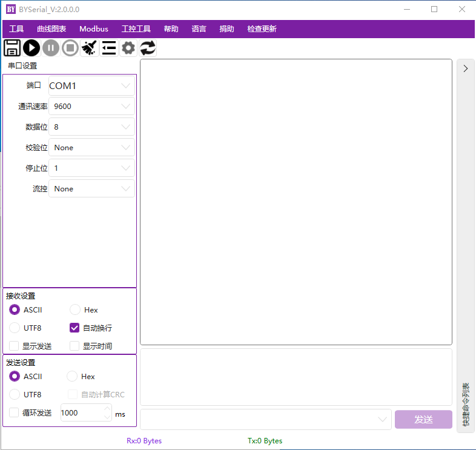
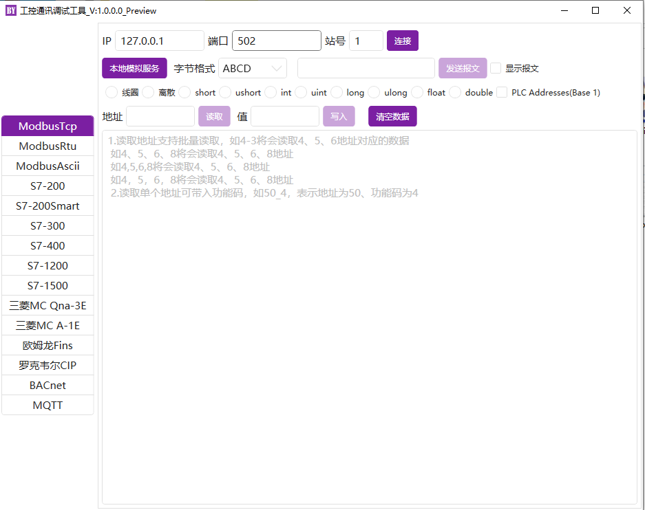
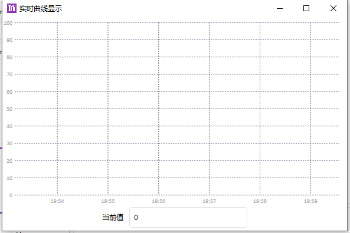
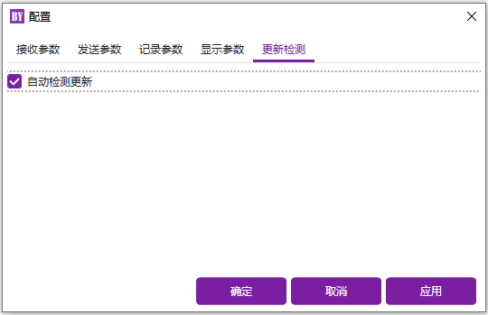
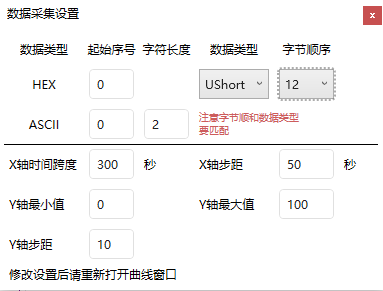

<h1 align="center">
BYSerial 
</h1>

## 微软Windows下的GUI串口调试工具  

- 欢迎使用BYSerial，这是一个用于Microsoft Windows的GUI串口调试工具。
- 有通用串口调试工具的一般功能。  
- 提供了编译好的版本，既可以参考源码编写自己的程序，又可以直接试用此工具。
- 如果您有任何问题，请在Issues发布，我将在方便的时候处理。谢谢你的使用。
- 欢迎提出想要的常用功能，方便的话，将添加上去。  
- 如果感兴趣，欢迎Watch和Star。 
- 开发工具：Visual Studio 2022  
- QQ交流群 750923887
  
## 系统环境  

已测试环境：  
Microsoft Window: WIN10 家庭中文版  版本2004 (内部版本19041)  
Microsoft Window: WIN10 专业版  版本20H2 (内部版本19042)

## 引用的部分第三方库  

HandyControl  https://gitee.com/handyorg/HandyControl  
Newtonsoft.Json https://github.com/JamesNK/Newtonsoft.Json  
LiveCharts https://v0.lvcharts.com/  
IOTClient https://gitee.com/zhaopeiym/IoTClient  
MQTTnet https://github.com/dotnet/MQTTnet  

## 赞助者
[](https://gitee.com/zhang-hai-long325520)
[](https://gitee.com/myyangang)


[](https://github.com/KafuuHiro/)
  
  
## 界面

    
    
    
    
    
    
    
    
    
    
    
    
    
    
 
## 功能介绍

### 已实现功能  
1.串口通讯调试  
2.TCP通讯调试  
3.常用小工具  
4.支持中英文双语切换  
5.自动检查版本更新  
6.支持添加自定义快捷命令  
7.支持ModbusRTU/ModbusAscii/ModbusTCP调试  
8.支持西门子/三菱/欧姆龙/罗克韦尔PLC通讯调试  
9.支持MQTT客户端，BACNet调试。  
10.支持串口接收数据曲线显示。
  
### 串口通讯详细功能：  
1.手动检测串口设备的增减  
2.支持流控  
3.接收发送编码方式同时支持ASCII和HEX方式  
4.ASCII模式时，可设置结束符，例如回车换行等  
5.HEX模式时，支持自动计算标准ModbusRTU的CRC16  
6.发送支持循环发送  
7.接收区显示支持显示发送和显示接收，并可设置发送和接收的字符串颜色  
8.接收区显示支持显示发送和接收的时间，时间格式可自定义  
9.底部显示串口状态，总接收字节数和总发送字节数。各字节数可手动清零  
10.接收区字符串可一键清空  
11.记录发送历史，支持记录最新的10条历史记录  
12.可将接收区显示的字符实时保存到本地txt文档  

### TCP通讯调试功能：  
1.支持TCP Client/TCP Server  
2.TCP Server时，可显示当前连接客户端列表  
3.TCP通讯采取异步方式通讯  
4.支持串口通讯功能中的3-12项  
5.支持UTF8编码，可发送中文  
6.不支持TCP连接断开的自动侦测  

### 小工具  
1.通用校验方法中包含常用的LRC,XOR,CheckSum,FCS,Modbus-CRC16等校验的计算  
2.数据转换包含整数和小数与16进制HEX的转换  
3.图片与base64互转  
4.数据采集中常用的模拟量与工程量转换计算  
5.ASCII码表  
6.C# 颜色对照表  
7.拾取屏幕颜色。该功能使用鼠标hook实现。通过hook技术可实现拦截或者修改键盘鼠标等的操作，对于有这方面需求的可以参考  

## 检查更新
检查更新方式：  
利用gitee作为更新检查的服务器，将版本号和下载连接写在gitee项目文件中，实现自动检查更新并提供下载连接的功能  

## 快捷命令列表  
对于调试时，常用的命令可以在此处设置，方便快速调试  

## ModbusRTU/ModbusAscii/ModbusTCP调试  
PLC、MQTT、BACNet等在工控工具界面中。  

## 关于Siemens的PLC地址
```
VB263、VW263、VD263中的B、W、D分别表示：byte型(8位)、word型(16位)、doubleword型(32位)。

在本组件传入地址的时候不需要带数据类型，直接使用对应方法读取对应类型即可，如：
VB263       - V263
VD263       - V263
VD263       - V263
DB108.DBW4  - DB108.4
DB1.DBX0.0  - DB1.0.0
DB1.DBD0    - DB1.0
```
|C#数据类型 | smart200 | 1200/1500/300
|---|---|---
|bit | V1.0 | DB1.DBX1.0
|byte | VB1 | DB1.DBB1
|shor <br> ushort  | VW2 | DB1.DBW2
|int <br> uint <br> float | VD4 | DB1.DBD4

## 曲线图表功能使用
先进行曲线设置，然后再打开曲线显示界面，只支持单数据采集。  
    
HEX行 [起始序号] 为数据在返回的HEX字符串中的位置，序号从0开始，字节顺序为对应数据类型中字节解码顺序，注意字节顺序要和前面的数据类型相匹配，否则无法解析。  
ASCII行 [起始序号]和[字符长度]截取需要的一个数值，序号从0开始。  


## 相关开源项目  
跨平台（linux/windows)串口通讯源码开源连接  
xuyuanbao/BaoYuanSerial: A GUI Serial Debug Tool for Linux/Microsfot Window (github.com)  
https://github.com/xuyuanbao/BaoYuanSerial