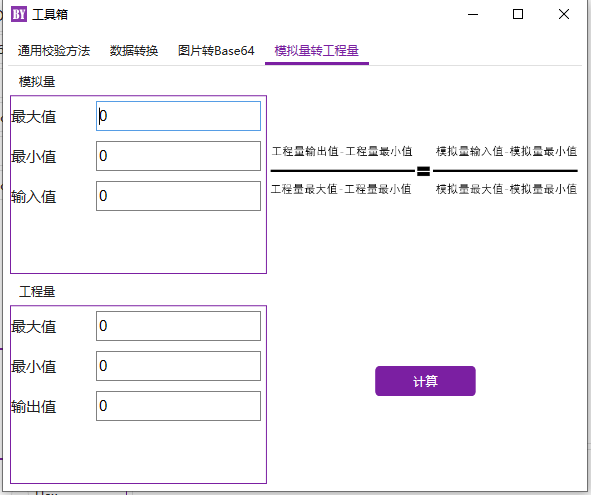
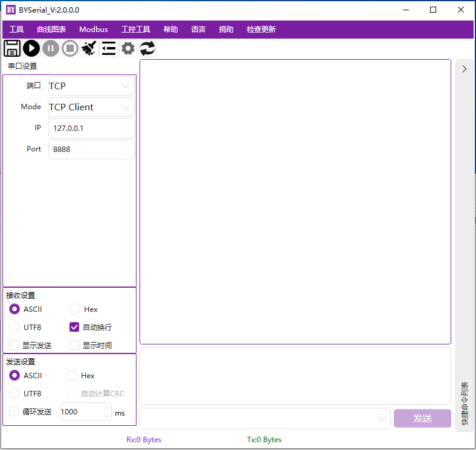
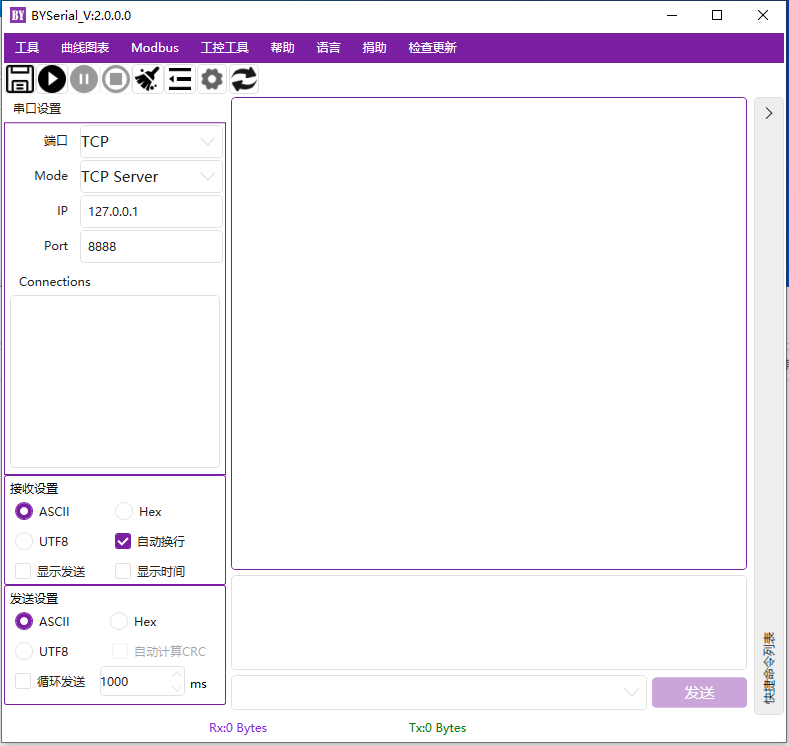
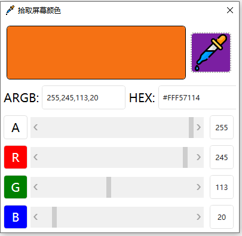
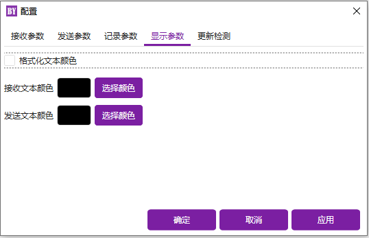

微软Windows下的GUI串口调试工具
====
欢迎使用BYSerial，这是一个用于Microsoft Windows的GUI串口调试工具。  BYSerial有通用串口调试工具的一般功能。考虑支持TCP调试，还会增加一些工控调试常用小功能。  如果您有任何问题，请在Issues发布，我将在方便的时候处理。谢谢你的使用。  
如果感兴趣，欢迎Watch和Star。
  
系统环境
----
已测试环境：  
Microsoft Window: WIN10 家庭中文版  版本2004 (内部版本19041)  
Microsoft Window: WIN10 专业版  版本20H2 (内部版本19042)

Using
----
HandyControl  https://gitee.com/handyorg/HandyControl  
Newtonsoft.Json https://github.com/JamesNK/Newtonsoft.Json  

## 赞助者

  

更新
----
2022-03-22 V1.0  
1.初始化项目。   
2022-03-24 V1.1  
1.增加接收信息和发送信息颜色区分。  
2.保存语言，字符颜色，Log记录路径到本地。  
2022-03-25  
1.工具箱计算后字符串添加复制到剪贴板功能  
2.工具箱添加图片转Base64功能  
  
2022-03-26  
1.增加模拟量转工程量计算  
  
2022-03-27  
1.添加TCPClient/Server  
  
  
2022-04-01  
1.添加颜色对照表  
2.添加ColorPicker    
  
  
2022-04-020  
1.优化截图体验  
  拾取颜色前先对屏幕截图  
  左键单击停止hook  
2022-04-27  
1.修复循环发送无效问题  
2.选中历史发送消息后，自动填充到发送区  
2022-04-28  
1.修复数据转换时整数范围过大时程序闪退问题。  
2.数据转换时的整数区分位有符号和无符号方式。  
2022-05-26  
1.串口通讯速率改为可编辑
  
界面
----
    
    
    
    
    
    
    
    
    

