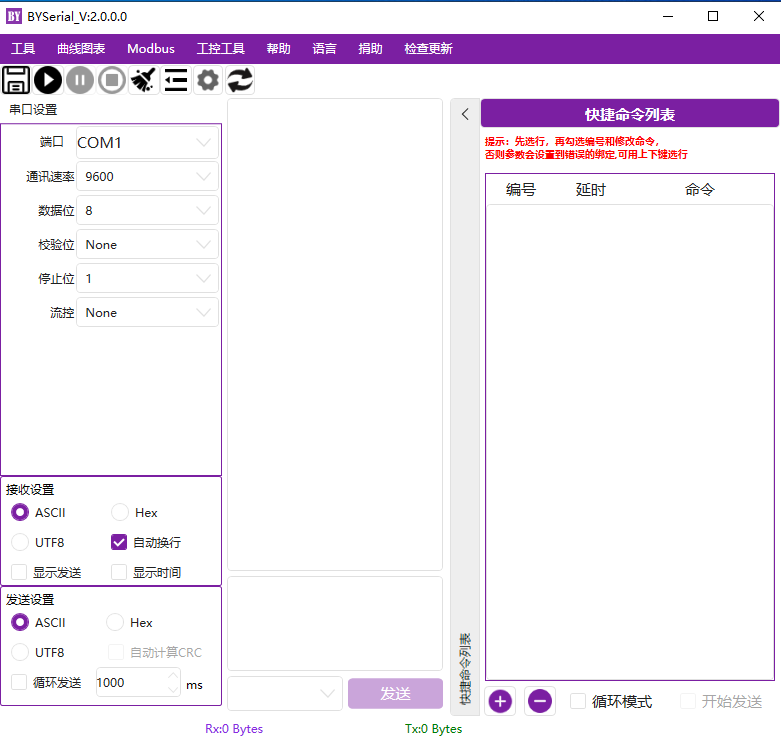
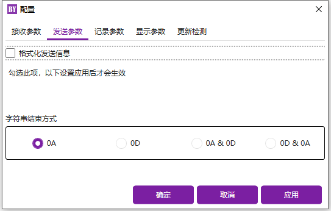

微软Windows下的GUI串口调试工具
====
欢迎使用BYSerial，这是一个用于Microsoft Windows的GUI串口调试工具。  BYSerial有通用串口调试工具的一般功能。考虑支持TCP调试，还会增加一些工控调试常用小功能。  如果您有任何问题，请在Issues发布，我将在方便的时候处理。谢谢你的使用。
  
系统环境
----
已测试环境：  
Microsoft Window: WIN10 家庭中文版  版本2004 (内部版本19041)  
Microsoft Window: WIN10 专业版  版本20H2 (内部版本19042)

Using
----
HandyControl  https://gitee.com/handyorg/HandyControl  
Newtonsoft.Json https://github.com/JamesNK/Newtonsoft.Json  

更新
----
2022-03-22 V1.0  
1.初始化项目。 
2022-03-24 V1.1  
1.增加接收信息和发送信息颜色区分。  
2.保存语言，字符颜色，Log记录路径到本地。  

界面
----
    
    
    
    
    
    
    
    
    
