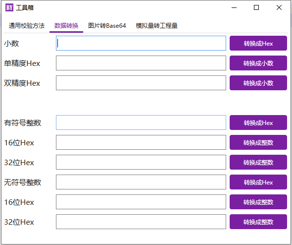

A GUI Serial Debug Tool for Microsoft Windows
====
Welcome to use the BYSerial that is a GUI serial debug tool for Microsoft Windows. BYSerial is a open source project based on C#. There are the general functions as COMMON serial port debug tool. More new features will be developed. If you have any question and bugs found, please don't hesitate to push a new ISSUE on Gitee for us, we will deal with it at our convenient time. Thanks for your using.
  

  
Eenvironment
----
已测试环境：  
Microsoft Window: WIN10 家庭中文版  版本2004 (内部版本19041)

Using
----
HandyControl  https://gitee.com/handyorg/HandyControl  
Newtonsoft.Json https://github.com/JamesNK/Newtonsoft.Json  

更新
----
2022-03-22 V1.0  
1.初始化项目。  

Interface
----
Microsoft Windows  
    
    
    
    
    
    
    
    
    
